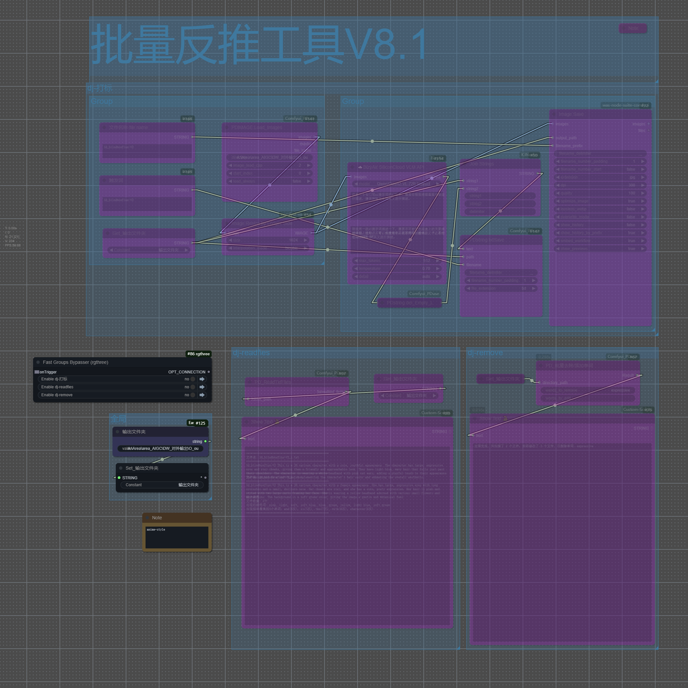

# ComfyUI PDuse

## 工作流用示例
在workflow目录下有json格式的工作流示例文件，示范了如何在ComfyUI中使用这些节点。

## 安装方法
(以ComfyUI官方便携包和秋叶整合包为例，其他ComfyUI环境请修改依赖环境目录)

### 安装插件
* 推荐使用 ComfyUI Manager 安装。
* 或者在CompyUI插件目录(例如"CompyUI\custom_nodes\")中打开cmd窗口，键入    
```
git clone 
```
* 或者下载解压zip文件，将得到的文件夹复制到 ```ComfyUI\custom_nodes\```。   
* Python环境下安装 pip install -r requirements.txt

## 常见问题
如果节点不能正常加载，或者使用中出现错误，请在ComfyUI终端窗口查看报错信息。以下是常见的错误及解决方法。

## 节点说明


#### **JSON处理**
##### PDJSON_Group​
- directory_path​​ ​​：指定要处理的JSON文件所在文件夹路径
- ​​color_choice​​​​：选择要批量修改的颜色（图中选为Blue）
- ​​modify_size​​​​：enable（启用修改）或 disable（保持原样）font_size​​
- ​​作用​​：当modify_size启用时，设置目标字体大小范围：8~72（仅在修改时生效）
- ​​target_title​​​​：指定只修改特定标题的组（留空则修改所有组）
- ​​output_folder指定输出文件夹路径（留空则覆盖原文件）
- ​​new_filename​​（图中为_fix01）新文件名后缀格式file.json → file_fix01.json
- ​​Result​​：输出显示处理结果（如成功/错误信息）

#### **text处理**

##### PD_ImageMergerWithText
> 字体文件可以放入文件夹fonts 。
> 两张图片合在一起，然后两个文字分别加上去，制作对比图使用。

- image1+ ​​​​image2 ：尽量要求同样尺寸，如果不同，会自动等比例缩放对齐
- text1 + text2   ：支持中文，需字体文件包含中文编码，可输入如"效果图"："原图"之类
- font_size​：小于20可能看不清，大于80可能超出画布
- ​​padding_up​：文字​​上方​​的留白高度，10-30
- ​​padding_down：文字​**​下方​**​的留白高度  10- 1000 ,可以往下扩多一些方便排版
- font_file​  选择字体样式, 需将.ttf/.otf文件放入插件目录的fonts文件夹
##### PD_Text Overlay Node
> PD_Text Overlay Node 主要作用是给图片添加文字，并且指定位置贴上去。
- image：要处理的输入图片
- text：需要叠加的文字内容 
- font_size：字体大小 
- font_color：文字颜色，使用HEX格式，如#000000 
- position_x：文字水平位置（0到1，0是左，1是右） 
- position_y：文字垂直位置（0到1，0是上，1是下） 
- letter_gap：字符间距（可为负数，负数使字母靠近） 
- font_name：使用的字体文件名（从fonts目录中选择）

#### **image处理**

**PD_Load_Images：**
directory: 指定包含图片的文件夹路径。
image_load_cap：限制最多加载数量，默认值: 0 表示无限制，如果填入数值则会限制具体多少张。
start_index (起始索引) 默认 0 从文件夹中的第几张图片开始加载（跳过前面的图片）。
load_always ： 设为True时，每次运行都强制重新加载（忽略缓存） false则是第一次加载，第二次不重复。
默认值: False

输出为image，mask 和paths.

workflow


### **PD:imageconcante_V1 节点说明**

用于将两张图片按指定方向拼接，支持多种尺寸对齐和裁切方式。

**参数说明：**
- **image1**：输入图片1（必填）
- **image2**：输入图片2（可选，不填时只输出image1）
- **direction**：合并方向，可选 right（右拼接）、down（下拼接）、left（左拼接）、up（上拼接）
- **match_size**：尺寸对齐方式
  - `longest`：两张图片都按最长边等比缩放后合并，保持各自比例
  - `crop by image1`：image2 先等比缩放到能覆盖image1，再以image1尺寸为基准进行裁切
- **image2_crop**：当 match_size 选择 `crop by image1` 时，image2 的裁切方式
  - `center`：居中裁切
  - `top`：顶部裁切
  - `bottom`：底部裁切
  - `left`：左侧裁切
  - `right`：右侧裁切

**功能说明：**
- 支持自动对齐图片批次（batch）和通道数。
- 支持 image2 缺省时直接输出 image1。
- 支持多种合并方向和尺寸对齐逻辑，满足对比、拼接等多种场景。

**典型用法举例：**
- 横向拼接两张不同尺寸图片，选择 `longest` 可自动等比缩放对齐高度。
- 需要严格对齐image1尺寸时，选择 `crop by image1` 并设置裁切方式。

### **PD:Image Blend V1 节点说明**

用于将两张图片进行混合，支持多种混合模式、透明度控制和位置调整。

**参数说明：**
- **background_image**：背景图像（必填）
- **layer_image**：图层图像（必填）
- **blend_mode**：混合模式，支持以下选项：
  - `normal`：正常混合
  - `multiply`：正片叠底
  - `screen`：滤色
  - `overlay`：叠加
  - `soft_light`：柔光
  - `hard_light`：强光
  - `color_dodge`：颜色减淡
  - `color_burn`：颜色加深
  - `darken`：变暗
  - `lighten`：变亮
  - `difference`：差值
  - `exclusion`：排除
- **opacity**：透明度（0-100）
- **x_percent**：X轴位置百分比（50为居中）
- **y_percent**：Y轴位置百分比（50为居中）
- **scale**：缩放比例（0.01到10）
- **align_mode**：对齐模式
  - `default`：默认居中
  - `top_align`：顶部对齐
  - `bottom_align`：底部对齐
  - `left_align`：左侧对齐
  - `right_align`：右侧对齐
- **layer_mask**：可选的图层遮罩
- **invert_mask**：是否反转遮罩（默认False）
<<<<<<< HEAD
---

PD:Image Rotate
功能
对图片进行任意角度旋转，自动适配输出尺寸，避免内容被裁切，黑边最小化。
输入参数
images：输入图片（支持批量）
mode：旋转模式
internal：任意角度旋转
transpose：仅支持90度倍数旋转
rotation：旋转角度（-360 ~ 360，步进1度）
sampler：插值方式
nearest：速度快，质量低
bilinear：均衡
bicubic：质量最好
输出
images：旋转后的图片
=======
---
>>>>>>> 2bd70b0da2a8ac643f75f6f89a8bd938f22ed02f
